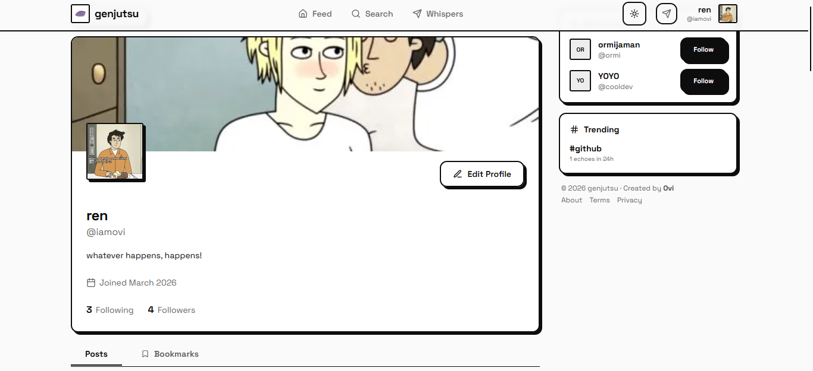
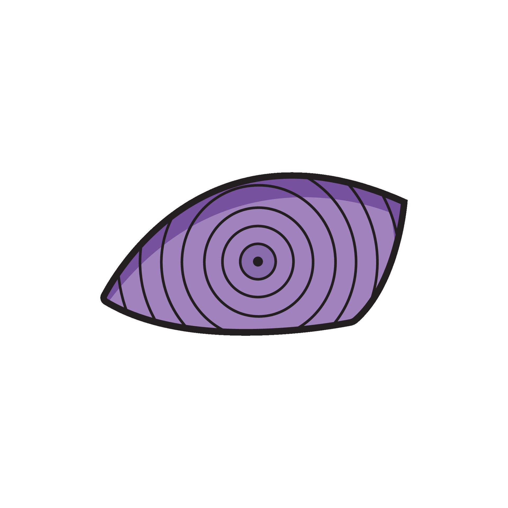
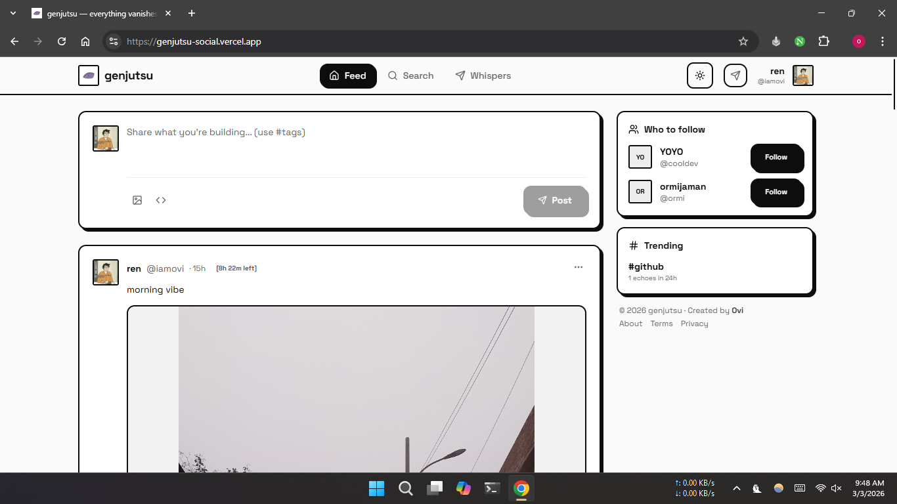
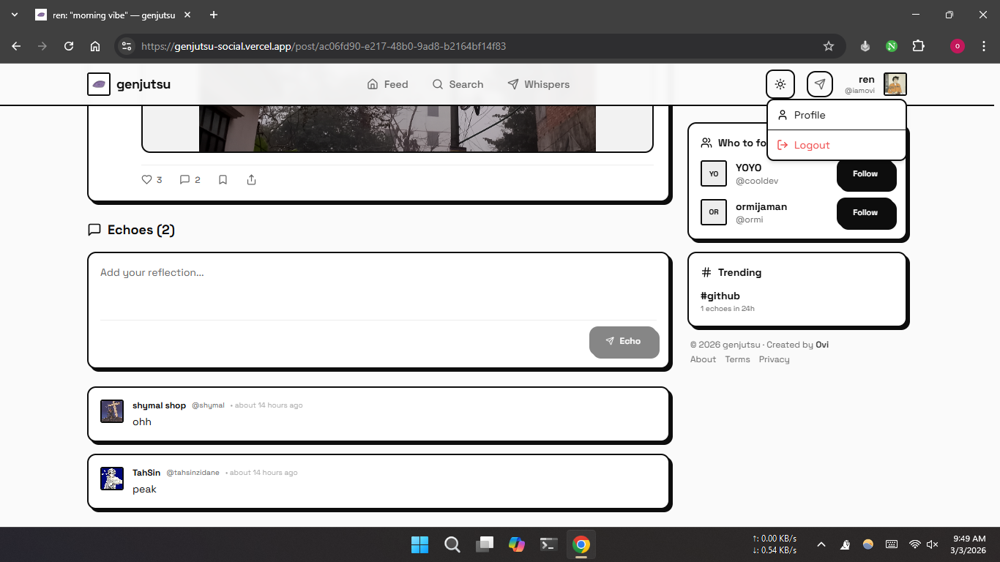
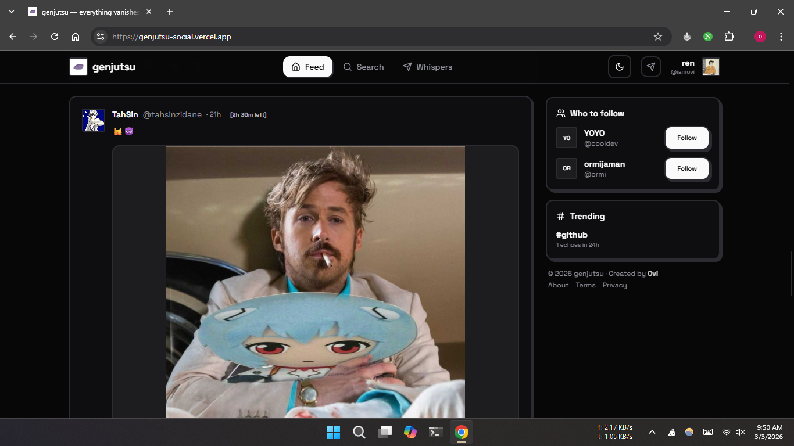
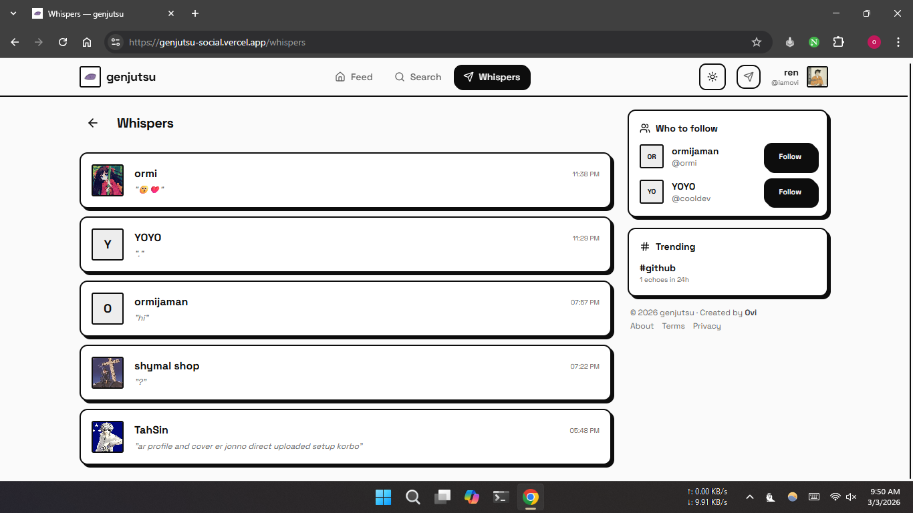
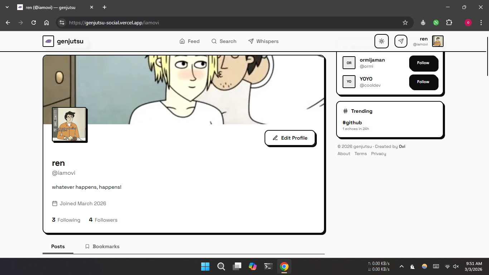
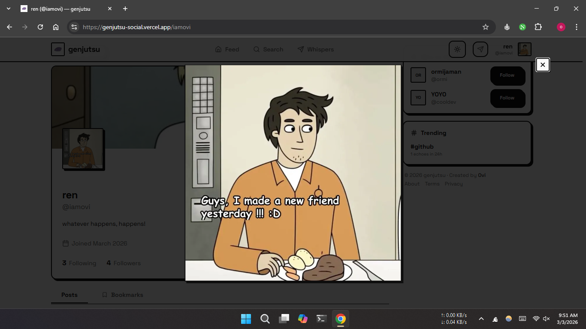

**Live App: https://genjutsu-social.vercel.app**

`genjutsu` is a social network for developers where everything disappears after 24 hours.

share code, post updates, connect with other builders. no permanent history, no follower counts, no clout chasing. just a daily feed that resets every morning.

## why 24 hours?

most social platforms accumulate posts forever. your late-night takes, half-baked ideas, and experimental code snippets stay online permanently. genjutsu is different.

every post, comment, and message automatically deletes after 24 hours. this means:
- you can post freely without worrying about your permanent record
- the feed stays fresh and relevant
- storage and database costs stay minimal
- performance stays fast no matter how many users join

think snapchat meets twitter, but built for developers.

## features

- ephemeral posts - everything vanishes in 24 hours, no exceptions
- code sharing - optimized for sharing snippets and technical content
- realtime updates - see new posts and comments as they happen
- direct messages - private whispers that also disappear after 24 hours
- tags - organize content by topics and interests
- media uploads - share images alongside your posts
- dark mode - because of course

## tech stack

- react + typescript + vite
- tailwindcss + shadcn/ui
- supabase (database + auth + storage + realtime)
- react query for data management
- vercel for hosting

### architecture highlights

- uses row level security (rls) for data access control
- realtime subscriptions for live updates
- optimized queries with proper indexes
- image uploads stored in supabase storage buckets
- pagination for efficient data loading

## contributing

want to contribute? see [CONTRIBUTING.md](CONTRIBUTING.md) for setup and guidelines.

## why open source?

building a social network is hard. building it alone is harder. by making genjutsu open source:

- you can see exactly how your data is handled
- you can contribute features you want
- you can learn from real production code
- you can self-host if you want

plus, the best developer tools are built by developers, for developers.

## license

mit - see [LICENSE](../LICENSE) file

## support

- create an issue for bugs or feature requests
- join discussions in the issues tab

## acknowledgments

built with:
- supabase for the backend infrastructure
- shadcn/ui for the component library
- vercel for hosting

---

made by developers who got tired of their old tweets haunting them.

### screenshots

